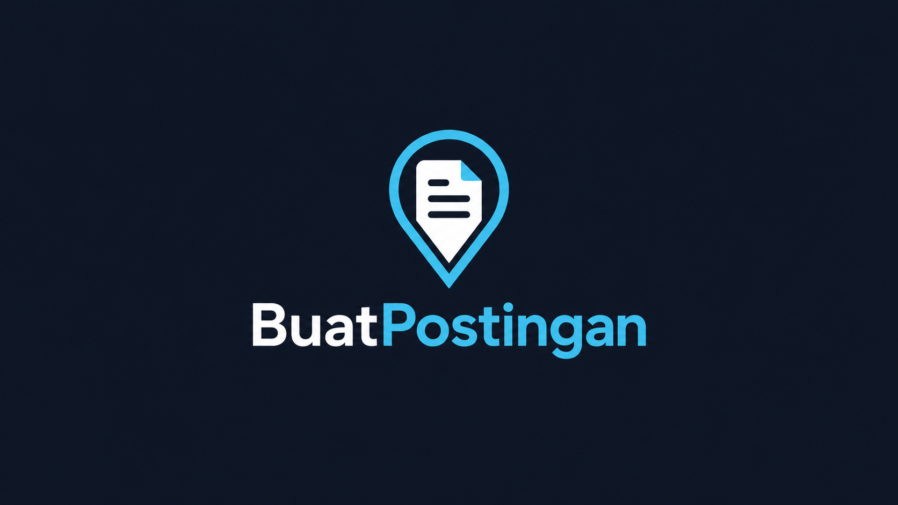
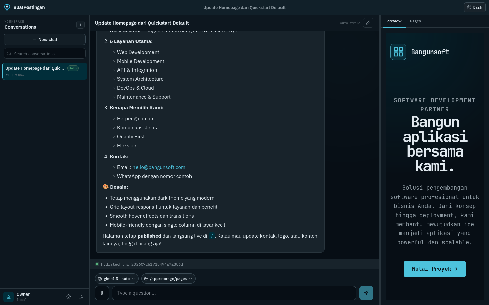
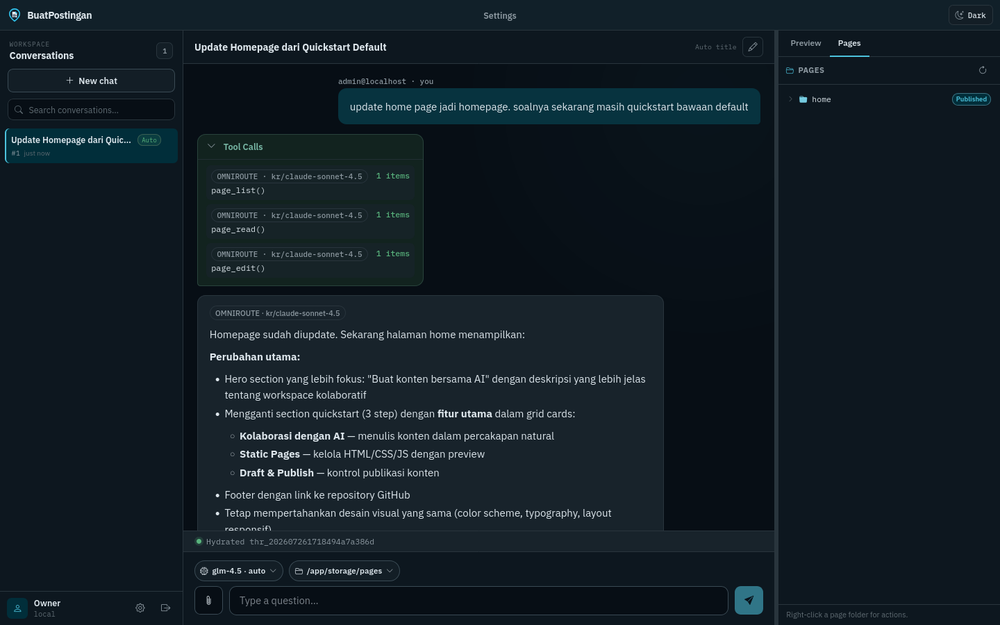
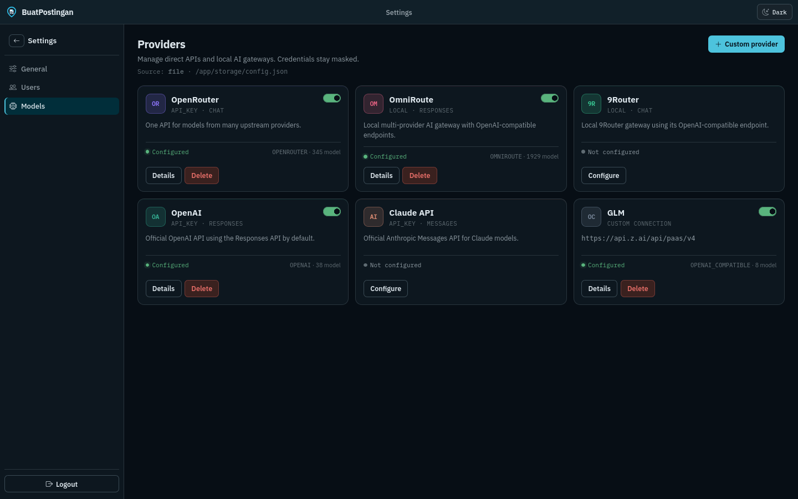

# BuatPostingan

**AI-first content publishing — the AI runs the site, you bring the ideas.**



<div align="center">
  <a href="docs/">Docs</a> ·
  <a href="docs/DEVELOPMENT.md">Development</a> ·
  <a href="docs/operations/runbook.md">Runbook</a> ·
  <a href="AGENTS.md">Agents</a>
</div>

Drupal, WordPress, and Joomla were built human-first: an AI has to fight through menus, forms, and modules just to publish a page. BuatPostingan flips that — the agent designs, writes, and ships pages directly from static-pages primitives. You supply the data and the intent; it drives the CMS.



---

## Quick start

```bash
git clone https://github.com/jahrulnr/BuatPostingan.git && cd BuatPostingan
cp .env.example .env          # optional
make be                       # http://localhost:8080/
```

Open the chat, drop in a topic or source material, and ask the agent to build a page. Stub mode works with no API keys; for live models, add providers in **Settings → Models** or edit `storage/config.json`, then set `BP_LLM_STUB=false`.

### Deploy with Docker

```bash
cp .env.example .env          # set BP_AUTH_ADMIN_USERNAME / PASSWORD for a real deploy
make docker-up                # build + docker compose up -d, http://localhost:1212/
```

[`compose.yml`](compose.yml) wraps [`deploy/Dockerfile`](deploy/Dockerfile) — a Go binary served behind nginx on port `1212`, `./storage` bind-mounted for JSONL/pages/auth persistence, homepage seeded and published on first boot. `make docker-restart` / `make docker-down` manage the stack.

Prefer a prebuilt image once CI publishes one:

```bash
docker run -d --name buatpostingan -p 1212:1212 -v buatpostingan_storage:/app/storage \
  ghcr.io/jahrulnr/buatpostingan:latest
```

Images are published to **GitHub Container Registry only** (no Docker Hub). See [Runbook](docs/operations/runbook.md) for the full env-var/volume reference and reverse-proxy notes.

---

## Why AI-first, not human-first

Traditional CMSes model the **human** workflow: log in, pick a content type, fill a form, hit save, hope the theme renders it right. Handing that to an AI means scripting around an interface designed for hands and eyes — a dozen brittle steps per page.

BuatPostingan inverts the design: the **agent** is the primary operator.

- **You provide raw material** — a brief, a data dump, a link, a half-written draft, a conversation.
- **The agent designs the page** — structure, copy, and layout come from one `page_create` / `page_edit` call, not a form wizard.
- **Publishing is a decision, not a pipeline** — going live is a symlink flip (`page_publish`), reversible with `page_unpublish`.
- **Humans stay in the loop where it matters** — review drafts in the Pages tab, approve, redirect, or hand the agent more context.

The result: content ops that scale with prompts, not with the number of people who know how to use the admin panel.

---

## What you get

### A chat that operates the site

- **Turn loop in a worker**, not the HTTP request — long publishing runs survive disconnects; SSE mirrors durable `seq`.
- **Streaming** via OpenAI-shaped `responses` / `chat` and Anthropic `messages`, with a model picker + effort control in the composer.
- Route across OpenRouter, OpenAI, Claude, OmniRoute, 9Router, or any custom OpenAI-compatible gateway.
- **Attachments** (images, source docs) feed the draft directly — vision gated by model capability.

### Static pages as the publishing primitive

- Draft under `storage/pages/<slug>/`; **publish is a symlink marker** (`.published/<slug>`), not a copy or a build step.
- **Pages tab** in the preview panel — tree view, Draft/Published badges, publish/unpublish/delete without leaving the chat.
- Agent tools own the full lifecycle: `page_list`, `page_search`, `page_create`, `page_edit`, `page_read`, `page_publish`, `page_unpublish`.



### Knowledge the agent can actually use

- Markdown corpus under [resources/webchat/docs/](resources/webchat/docs/) — indexed and searchable via doc tools, so the agent writes with your house style and facts, not guesses.
- **Skills** (`SKILL.md` per folder) loaded on demand for repeatable publishing playbooks.
- Workspace picker per conversation — point the agent at the source files a piece needs.

### Settings that fit a hosted product

- Product knobs in `storage/config.json` — limits, LLM globals, context, docs, MCP, providers — editable from the Settings UI or the file directly.
- **Users** and **Models** tabs for multi-provider, multi-operator setups; API keys masked on read, providers hot-reload without a restart.
- Session-cookie auth (`bp_session`) so the publishing surface can sit behind a login, not just localhost.



### Extensible without leaving the contract

- **MCP** (stdio MVP): progressive `list_mcp_tools` / `call_mcp_tool`; mutations default-denied until you allow them.
- **Portable AI kit** — the agent core (domain/usecase/infrastructure + webchat delivery) is designed to be copied into another product. See [portable-ai-kit.md](docs/architecture/portable-ai-kit.md).

---

## The workspace


| Area                   | What you get                                                |
| ---------------------- | ----------------------------------------------------------- |
| **Conversations rail** | Threads, search, new chat, settings entry                   |
| **Chat**               | Streaming messages, tool cards, reasoning, retry/stop       |
| **Composer**           | Model picker, workspace folder, attachments                 |
| **Preview panel**      | Live preview + **Pages** tree (draft → published lifecycle) |
| **Settings**           | General config, users, LLM providers                        |


UI knowledge-base docs (what the agent itself reads about the product): `[resources/webchat/docs/](resources/webchat/docs/)`

---

## Stack (short)


| Layer       | Choice                                                                       |
| ----------- | ---------------------------------------------------------------------------- |
| Frontend    | Vanilla JS ES modules, dual-driver mock | real                               |
| Backend     | Go 1.26.5+, light Clean Architecture                                           |
| Persistence | JSONL (`storage/webchat/`) for conversations, filesystem + symlink for pages |
| Config      | `storage/config.json` + `BP_*` env for paths                                 |
| LLM         | Provider registry — `chat` / `responses` / `messages`                        |


Architecture deep dive: [docs/architecture/README.md](docs/architecture/README.md)

---

## Documentation map


| For…                                | Start here                                                                                             |
| ----------------------------------- | ------------------------------------------------------------------------------------------------------ |
| Deploy / run                        | [Runbook](docs/operations/runbook.md)                                                                  |
| Build & contribute                  | [Development](docs/DEVELOPMENT.md)                                                                     |
| Turn loop, SSE, tools               | [Architecture index](docs/README.md)                                                                   |
| LLM providers & settings            | [LLM providers](docs/architecture/llm-providers.md) · [Settings](docs/architecture/settings-config.md) |
| Static pages / publishing lifecycle | [Static pages](docs/architecture/static-pages.md)                                                      |
| MCP & skills                        | [MCP](docs/architecture/mcp-support.md) · [Skills](docs/architecture/skills-tools.md)                  |
| Coding agents                       | [AGENTS.md](AGENTS.md)                                                                                 |


---

## Contributing

1. Read [DEVELOPMENT.md](docs/DEVELOPMENT.md) and [AGENTS.md](AGENTS.md).
2. `make test` before opening a PR.
3. Keep business rules in `internal/usecase`, not HTTP handlers.

---

## License

[MIT](LICENSE)