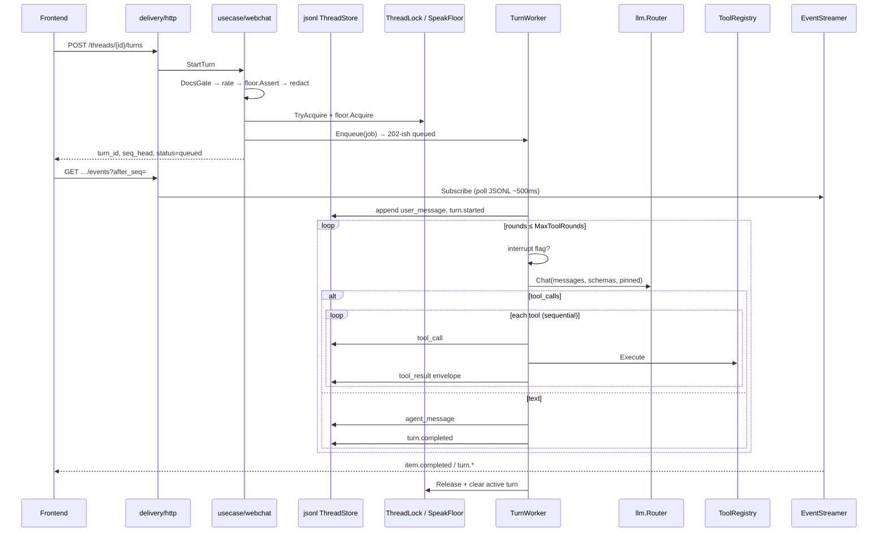

# Turn loop

End-to-end path for one chat turn. Agent work runs in the **TurnWorker** (in-process goroutine), not inside the HTTP request. SSE mirrors durable JSONL seq after each append.

## Sequence

## HTTP → usecase (`StartTurn`)

Order in `internal/usecase/webchat` (mirrors AIPedia controller order):

1. Validate non-empty message  
2. **Docs gate** — index must be usable  
3. Thread exists  
4. **Rate limit** (`TurnRateLimitPerMin`, default 10/min)  
5. **Speak floor Assert** — another admin may hold the floor  
6. **Redact** secrets in message  
7. **Lock** thread (`TryAcquire`)  
8. Allocate `turn_id`, **floor Acquire**  
9. Read `seq_head`, **Worker.Enqueue**, return `status=queued`

HTTP handler stays thin: call usecase only. Retry / interrupt are separate methods (`RetryTurn`, `InterruptTurn`).

## Worker (`internal/infrastructure/worker`)

`Enqueue` starts a goroutine with `TurnJobTimeoutSec` (default 120s, floor 30s). On exit: clear active turn meta + release lock.

### Cold start of a turn

| Path | Appends |
|---|---|
| New turn | `user_message` → `turn.started` |
| Retry (`IsRetry`) | `turn.resumed` (reuses prior user text) |

Then stub **or** agent loop.

### Stub (`BP_LLM_STUB` / no keys)

One canned `agent_message` (`(stub) received: …`) + `turn.completed`. No tools, no provider HTTP.

### Agent loop

1. Load tool schemas from registry; build messages from JSONL + inject prompts (`resources/webchat/prompts`)  
2. For `rounds` = 1…`MaxToolRounds` (default 8):  
   - If interrupt flag → `turn.failed` (`interrupted`) and stop  
   - `llm.Chat` (router; pin successful provider for later rounds)  
   - Optional `reasoning` item  
   - If **tool_calls**: append each `tool_call`, **Execute sequentially**, append `tool_result` envelopes, feed tool role messages back; continue  
   - Identical tool fingerprint twice → nudge; three times → runtime stop message + break  
   - Else append `agent_message` and break  
3. If exhausted rounds while still tool-only → runtime “max tool rounds” message  
4. Always finish with `turn.completed` (usage + model metadata when available)  
5. Maybe auto-title conversation from first user message  

Soft tool failures become envelopes (`ok: false`); they do not panic the turn. Hard LLM/store errors become `turn.failed`.

## Interrupt

`InterruptTurn` writes `{StorageRoot}/interrupt/{thread}/{turn}.flag`. Worker checks `IsRequested` each round, then Clears and emits `turn.failed` with code `interrupted`. Only the active-turn initiator may interrupt.

## SSE mirror

`sse.Streamer` polls `ThreadStore.GetThread(afterSeq)` every **500ms** and maps item types:

| JSONL type | SSE event |
|---|---|
| `turn.started` / `completed` / `failed` / `resumed` | `turn.*` |
| `user_message`, `agent_message`, `tool_call`, `tool_result`, `reasoning` | `item.completed` (payload wraps `item`) |
| other | `item.updated` |

HTTP adapter sends keepalive SSE comments (~15s). This is **not** token streaming from the LLM.

## Related

- [LLM providers](llm-providers.md) — what `llm.Chat` hits  
- [Architecture](README.md) — tools allowlist, JSONL layout, FE bubbles  
- [Runbook](../operations/runbook.md) — how to exercise stub vs real turns locally  
