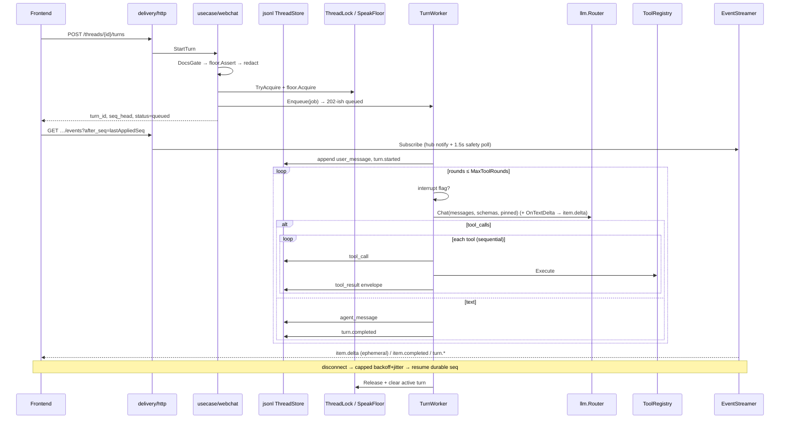

# Turn loop

End-to-end path for one chat turn. Agent work runs in the **TurnWorker** (in-process goroutine), not inside the HTTP request. SSE mirrors durable JSONL seq after each append.

## Sequence

## HTTP → usecase (`StartTurn`)

Order in `internal/usecase/webchat` (mirrors AIPedia controller order):

1. Validate non-empty message  
2. **Docs gate** — index must be usable  
3. Thread exists  
4. **Speak floor Assert** — another admin may hold the floor
5. **Redact** secrets in message
6. **Lock** thread (`TryAcquire`)
7. Allocate `turn_id`, **floor Acquire**
8. Read `seq_head`, **Worker.Enqueue**, return `status=queued`

HTTP handler stays thin: call usecase only. Retry / interrupt are separate methods (`RetryTurn`, `InterruptTurn`).

## Worker (`internal/infrastructure/worker`)

`Enqueue` starts a goroutine with `TurnJobTimeoutSec` (default 120s, floor 30s). On exit: clear active turn meta + release lock.

### Cold start of a turn

| Path | Appends |
|---|---|
| New turn | `user_message` → `turn.started` |
| Retry (`IsRetry`) | `turn.resumed` (reuses prior user text) |

Then stub **or** agent loop.

### Stub (`BP_LLM_STUB` / no keys)

One canned `agent_message` (`(stub) received: …`) + `turn.completed`. No tools, no provider HTTP.

### Agent loop

1. Load tool schemas from registry; build messages from JSONL + inject prompts in order: `system.md` → `docs.md` → `skills.md` → `pages.md` → rendered `developer.md` (`resources/webchat/prompts`)
2. **Context compaction** (optional): when `BP_CONTEXT_COMPACTION_ENABLED=true` and not stub, estimate transcript tokens (`chars/4`). If over `MAX_INPUT − RESERVE`, summarize older turns via `llm.Router` (prompt `compact.md`), append durable `context_compacted` (`compacted_through_seq`), keep the last `BP_CONTEXT_RECENT_TURNS` raw (never drop the latest user turn). Stub / disabled / LLM failure: no-op or extractive fallback — turn still proceeds (`webchat.compact` log).  
3. For `rounds` = 1…`MaxToolRounds` (default 8):  
   - If interrupt flag → `turn.failed` (`interrupted`) and stop  
   - `llm.Chat` (router; pin successful provider for later rounds). Transient SSE transport drops (`SSE_TRANSPORT` — incomplete / early close / mid-stream) retry inside the router budget before the worker sees failure.  
   - Optional `reasoning` item  
   - If **tool_calls**: append each `tool_call`, **Execute sequentially**, append `tool_result` envelopes, feed tool role messages back; continue  
   - Identical tool fingerprint twice → nudge; three times → runtime stop message + break  
   - Else append `agent_message` and break (empty/reasoning-only rounds may nudge once — semantic, not transport)  
4. If exhausted rounds while still tool-only → runtime “max tool rounds” message  
5. Always finish with `turn.completed` (usage + model metadata when available)  
6. **Auto-title**: if `title_source` is still pending — stub truncates first user text sync; real LLM schedules an async goroutine (inherits turn `trace_id`, fallback `system`) that titles ≤6 words, writes meta `title_source=auto`, and may emit ephemeral `conversation.updated`. Manual titles are never overwritten; title failure never fails the turn.  

Soft tool failures become envelopes (`ok: false`); they do not panic the turn. Hard LLM/store errors become `turn.failed`.

## Interrupt

`InterruptTurn` writes `{StorageRoot}/interrupt/{thread}/{turn}.flag`. Worker checks `IsRequested` each round, then Clears and emits `turn.failed` with code `interrupted`. Only the active-turn initiator may interrupt.

## SSE mirror

`sse.Streamer` wakes primarily from an in-process **hub** (`Notify` on durable JSONL append; `PublishEphemeral` for live deltas). A **1.5s** safety ticker covers missed wakes. JSONL remains the durable seq source of truth.

| Source | SSE event | Seq / `id:` |
|---|---|---|
| JSONL `turn.*` | `turn.*` | yes |
| JSONL `user_message`, `agent_message`, `tool_call`, `tool_result`, `reasoning` | `item.completed` (wraps `item`) | yes |
| LLM text while generating | `item.delta` (`field=text`) | **no** (ephemeral) |
| other JSONL | `item.updated` | yes |

HTTP adapter sends keepalive SSE comments (~15s).

Worker path: provider SSE → `OnTextDelta` → hub `item.delta` → final durable `agent_message` + `item.completed`. Details and FE rules: [realtime-streaming.md](realtime-streaming.md).

The FE keeps a durable cursor per thread. It ignores durable events at or below that cursor, never advances it for `item.delta`, and reconnects an active turn with `after_seq=<lastAppliedSeq>`. A stream generation guard blocks callbacks after thread switch, completion, or interruption. While waiting for the first reasoning/tool/text item, one “Thinking…” placeholder occupies the future assistant bubble; final durable content reconciles it. Timeline updates auto-follow only when the reader is near the bottom.

## Related

- [Realtime streaming](realtime-streaming.md) — deltas, durable resume, reconnect, and perceived-latency UX
- [LLM providers](llm-providers.md) — what `llm.Chat` hits
- [XML / pipe tool calls](xml-tool-calls.md) — fallback parser for models that emit tool calls as text instead of native JSON
- [Architecture](README.md) — tools allowlist, JSONL layout, FE bubbles
- [Runbook](../operations/runbook.md) — how to exercise stub vs real turns locally
